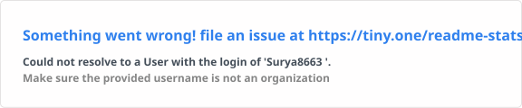
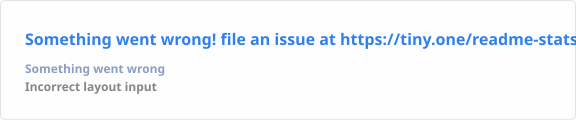

<!--
╔══════════════════════════════════════════════════════════════╗
║              G. SURYA — GITHUB PROFILE v3.1                  ║
║         [ FIXED · ALL STATS SELF-HOSTED IN REPO ]            ║
╚══════════════════════════════════════════════════════════════╝
-->

<div align="center">


<br/>

<a href="https://git.io/typing-svg">

</a>

</div>

<br/>

<!-- ═══════════════════════════════════════════════════════════ -->
<!--                    HERO — IMAGE + IDENTITY                  -->
<!-- ═══════════════════════════════════════════════════════════ -->

<table border="0" cellpadding="0" cellspacing="0" width="100%">
<tr>
<td width="38%" align="center" valign="middle">


<br/><br/>

[](https://www.linkedin.com/in/g-surya-63a01b290)&nbsp;
[](mailto:iamsurya195@gmail.com)&nbsp;
[](https://surya8663.github.io)


</td>
<td width="4%"></td>
<td width="58%" valign="middle">

<h1>G. Surya</h1>

**`Product GenAI Developer Intern`** at **[HiDevs](https://www.linkedin.com/company/hidevs-community/)** · SF Bay Area

> *Building the layer between raw LLMs and the real world — agentic systems that reason, route, and ship.*

<br/>

```python
surya = {
  "focus"    : ["Multi-Agent AI", "RAG Pipelines", "LLM R&D"],
  "stack"    : ["LangGraph", "CrewAI", "LangChain", "FastAPI"],
  "cloud"    : ["Oracle OCI", "Docker", "Render", "Vercel"],
  "edu"      : "B.E. CS @ TJIT (2023–2027)",
  "location" : "Bengaluru, India 🇮🇳",
  "status"   : "open_to_collabs = True",
}
```

<br/>


</td>
</tr>
</table>

<br/>

---

<!-- ═══════════════════════════════════════════════════════════ -->
<!--                      FEATURED PROJECTS                      -->
<!-- ═══════════════════════════════════════════════════════════ -->

## &nbsp;`// Projects`

<table border="0" cellpadding="12" cellspacing="0" width="100%">
<tr>

<td width="25%" align="center" valign="top">
<a href="https://github.com/Surya8663/genai-multi-agent-chatbot">

</a>
<br/><br/>

**GenAI Multi-Agent Chatbot**

<sub>Intelligent conversation routing with specialized domain agents. Dynamic LangGraph orchestration — agents that collaborate autonomously.</sub>

<br/>


</td>

<td width="25%" align="center" valign="top">
<a href="https://github.com/Surya8663/ai-job-application-suite">

</a>
<br/><br/>

**AI Job Application Suite**

<sub>Resume tailoring, cover letter gen & interview prep from one job description. Multi-agent CrewAI pipeline.</sub>

<br/>


</td>

<td width="25%" align="center" valign="top">
<a href="https://github.com/Surya8663/SecurePulse">

</a>
<br/><br/>

**SecurePulse**

<sub>Real-time threat detection with AI-assisted anomaly surfacing, vulnerability scanning, and live analytics dashboard.</sub>

<br/>


</td>

<td width="25%" align="center" valign="top">
<a href="https://github.com/Surya8663/story_teller_ai">

</a>
<br/><br/>

**Story Teller AI**

<sub>Narrative engine for immersive multi-genre stories. Dynamic world-building, evolving characters, branching plots via NLP.</sub>

<br/>


</td>

</tr>
</table>

<div align="right">

[](https://github.com/Surya8663?tab=repositories)

</div>

---

<!-- ═══════════════════════════════════════════════════════════ -->
<!--        STATS — ALL SERVED FROM YOUR OWN REPO (NO BREAKS)   -->
<!-- ═══════════════════════════════════════════════════════════ -->

## &nbsp;`// Stats`

<!--
  ⚠️  These images are generated daily by GitHub Actions (.github/workflows/stats.yml)
      and committed to the profile/ folder in this repo.
      They NEVER hit an external rate-limited API — so they always load.
-->

<div align="center">


&nbsp;


<br/><br/>



<br/><br/>



</div>

---

<!-- ═══════════════════════════════════════════════════════════ -->
<!--                    EXPERIENCE TIMELINE                      -->
<!-- ═══════════════════════════════════════════════════════════ -->

## &nbsp;`// Experience`

```
2024 ──────────────────────────────────────────────────────────── present

  ◆  Product GenAI Developer Intern
     HiDevs · San Francisco Bay Area (Remote)
     Nov 2024 → Present

     ∟ Multi-agent AI orchestration (LangGraph, CrewAI)
     ∟ Production RAG pipeline design & deployment
     ∟ LLM R&D — fine-tuning, prompt engineering, evaluation
     ∟ GenAI system architecture: concept → shipping

2023 ──────────────────────────────────────────────────────────── 2024

  ◇  Student Intern
     Comedkares · Bengaluru, KA
     Sep 2023 → Jan 2024

     ∟ Software development lifecycle exposure
     ∟ Technology-driven project delivery
```

---

<!-- ═══════════════════════════════════════════════════════════ -->
<!--                      CERTIFICATIONS                         -->
<!-- ═══════════════════════════════════════════════════════════ -->

## &nbsp;`// Certifications`

<div align="center">

| Certification | Issuer | Badge |
|:---|:---|:---:|
| OCI 2025 AI Foundations Associate | Oracle |  |
| Certified Educator | Google |  |
| Intro to Generative AI | Google Cloud |  |
| Prompt Engineering for GenAI | DeepLearning.AI |  |
| Cybersecurity Virtual Experience | Tata / Forage |  |

</div>

---

<!-- ═══════════════════════════════════════════════════════════ -->
<!--             TROPHIES — ALSO SELF-HOSTED SVG                -->
<!-- ═══════════════════════════════════════════════════════════ -->

## &nbsp;`// Trophies`

<div align="center">


</div>

---

<br/>

<div align="center">

<sub>

`< code is poetry />` &nbsp;·&nbsp; Open to collabs, internships & open-source &nbsp;·&nbsp; `> commit > push > build > repeat`

</sub>

<br/>

[](https://www.linkedin.com/in/g-surya-63a01b290)
[](mailto:iamsurya195@gmail.com)
[](https://surya8663.github.io)

<br/>


</div>